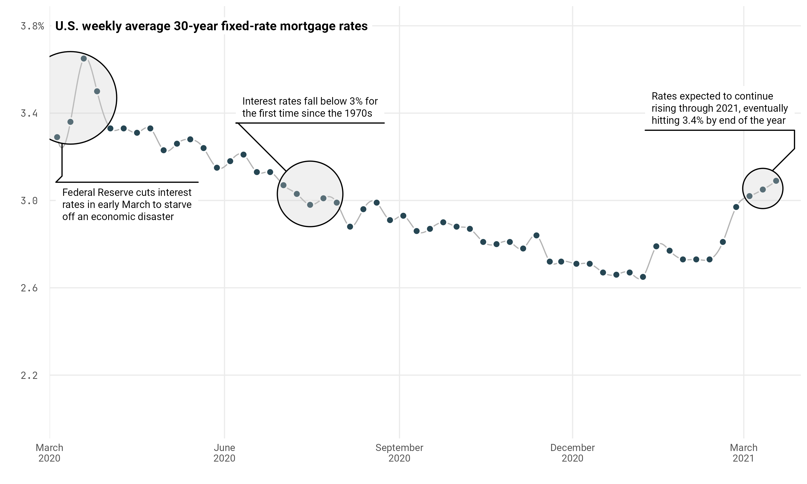
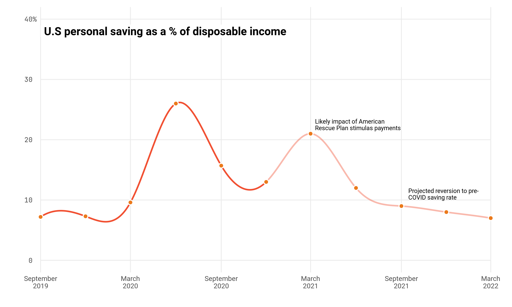
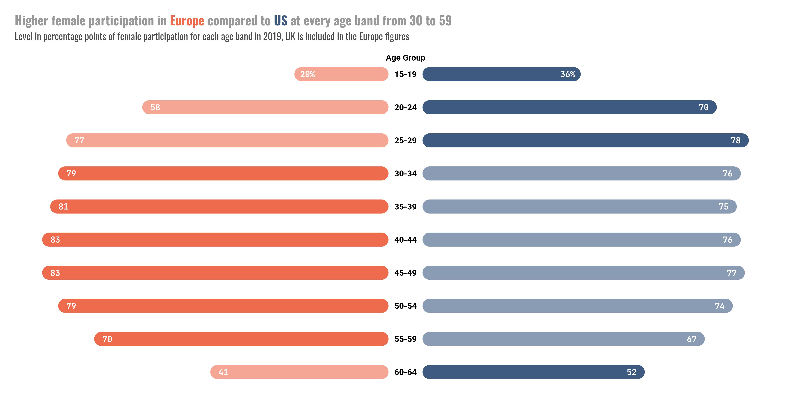
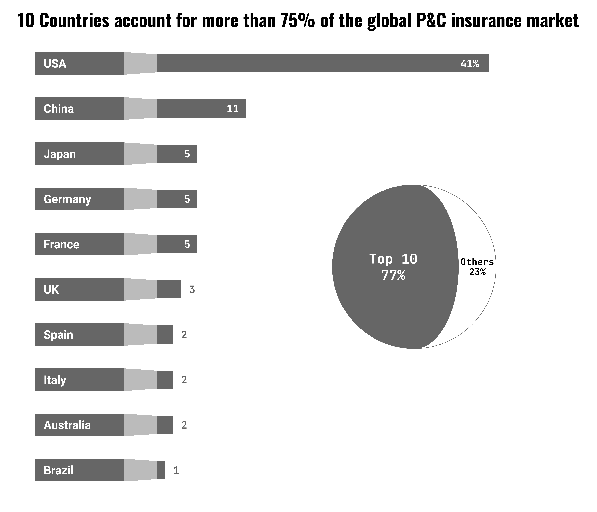
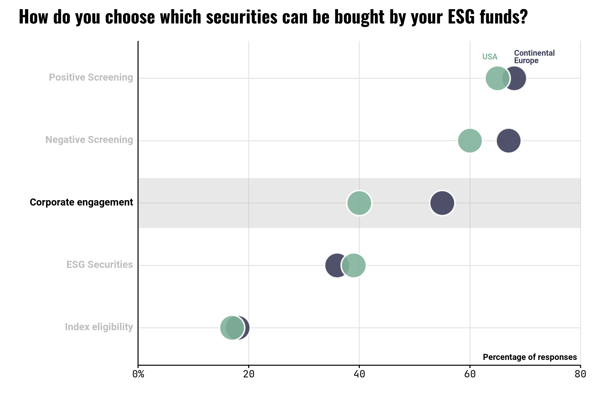
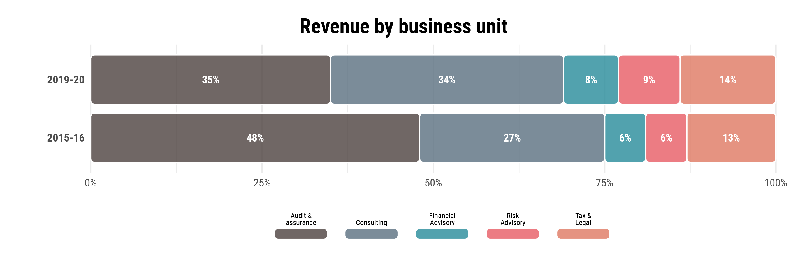
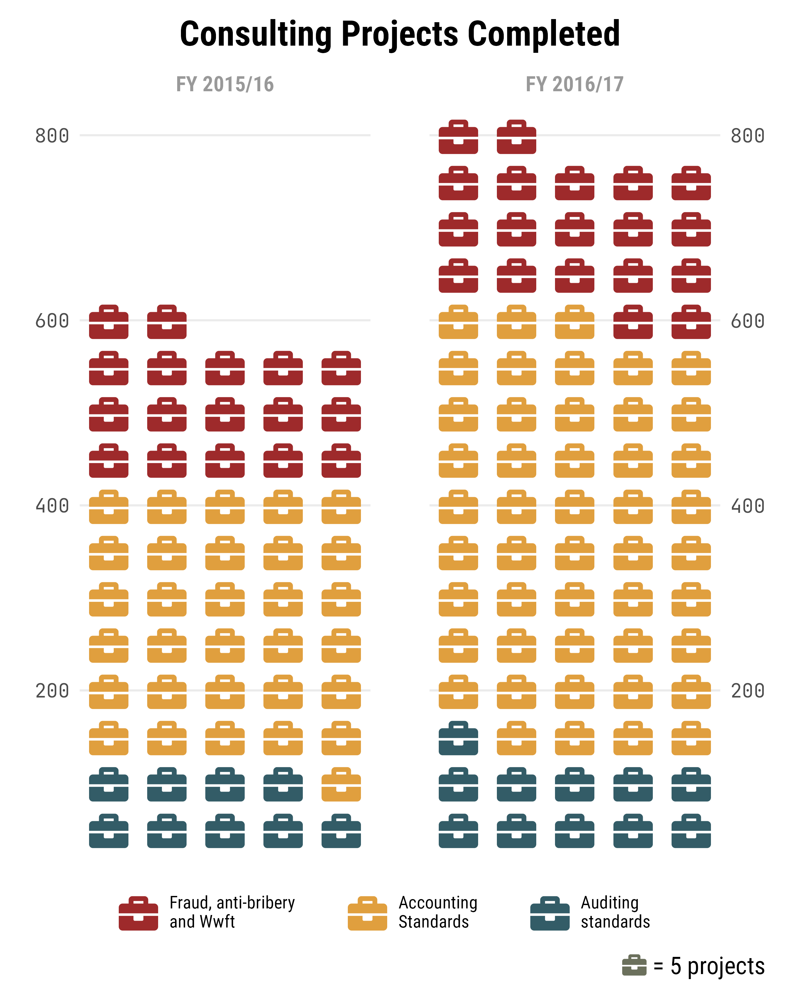

# dataviz-makeover

## Realtor Plot 1 [<a href='realtor-plot-1/code.R'>Code</a>]

## Realtor Plot 2 [<a href='realtor-plot-2/code.R'>Code</a>]

## BlackRock Plot [<a href='blackrock-plot/code.R'>Code</a>]

## Goldman Sachs Plot [<a href='goldmansachs-plot/code.R'>Code</a>]

## Allianz Plot [<a href='allianz-plot/code.R'>Code</a>]

## Barclays Plot [<a href='barclays-plot/code.R'>Code</a>]

## Deloitte Plot [<a href='deloitte-plot/code.R'>Code</a>]

## KPMG Plot [<a href='kpmg-plot/code.R'>Code</a>]

